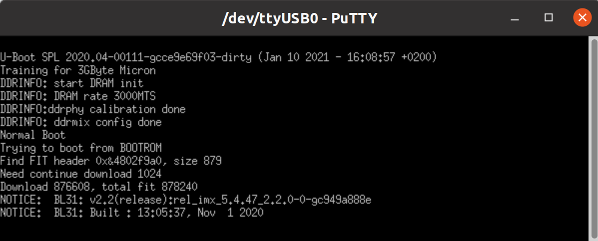

# Boot from USB OTG - i.MX8M

## Revisions and Notes

| **Date**          | **Owner**                                                                                                                                                                                                                                                                                                                      | **Revision** | **Notes**       |
| ----------------- | ------------------------------------------------------------------------------------------------------------------------------------------------------------------------------------------------------------------------------------------------------------------------------------------------------------------------------ | ------------ | --------------- |
| 23 Feb 2022       |                                                                                                                                                                                                                                                                                                                                | 1.0          | Initial release |
| Table Of Contents | <p>- <a href="boot-from-usb-otg-imx8m.md#revisions-and-notes">Revisions and Notes</a><br>- <a href="boot-from-usb-otg-imx8m.md#introduction">Introduction</a><br>- <a href="boot-from-usb-otg-imx8m.md#step-by-step">Step-by-step</a><br>- <a href="boot-from-usb-otg-imx8m.md#imx8m-plus-example">i.MX8M-Plus Example</a></p> |              |                 |

## Introduction

The following documentation provides a quick guide to boot from USB OTG port.

## Step-by-step

1\. Clone the mfgtools project by running the following:

```
git clone https://github.com/NXPmicro/mfgtools.git
```

* Please follow the [Build instructions](https://github.com/NXPmicro/mfgtools#linux).


Please make sure to have cmake 3.19 or a newer version.



2\. Install U-Boot binaries

* You can Install U-Boot binaries from [SolidRun Images](https://images.solid-run.com/IMX8/U-Boot) site.

3\. Set the switches on the boot source selector as follows:


4\. Serial connection

Connect your micro USB cable to your device.

* You can refer to the serial connection section in one of our quick start guide pages - [Cubox-M](/nxp/imx8/sbc-platform/cubox-m-quick-start-guide.md#booting-from-an-sd-card), [HummingBoard Pulse](/nxp/imx8/sbc-platform/hummingboard-imx8-sbc-quick-start-guide/hummingboard-pulse-imx8m-plus-som-quick-start-guide.md#booting-from-sd-card).

5\. Connect the Male to Male USB-A cable to the OTG port on your device.


**Identify the OTG port**\
It’s the upper USB port. This holds true of all our i.MX8 based boards.



* Make sure you can detect the USB = NXP Semiconductors in the usb devices list.

6\. Use the following commands for loading the U-Boot:

```
cd <DIRPATH>/mfgtools/uuu/
sudo ./uuu <flash.bin-dir>/flash.bin
```

* For more information about the uuu tools, you can refer to [https://github.com/NXPmicro/mfgtools](https://github.com/NXPmicro/mfgtools)

## i.MX8M-Plus Example

**The following is an example for i.MX8M-Plus Step-by-step:**

1\. Once you built the mfgtools, run the following to install the U-Boot binaries

```
wget https://solid-run-ignition.sos-de-fra-1.exo.io/imx8mp/Buildroot/flash-uboot-1g-and-3g.bin
```

* You can build your own image using the runme.sh script here – [https://github.com/SolidRun/imx8mp\_build](https://github.com/SolidRun/imx8mp_build). The flash.bin should be under  $ROOGitHub - SolidRun/imx8mp\_build: IMX8M Plus buildroot build script​.TDIR/build/imx-mkimage/iMX8M/flash.bin

2\. Connect your micro USB cable to your device.

3\. Connect the Male to Male USB-A cable to the OTG port on your device.

* Make sure you can detect the USB = NXP Semiconductors in the usb devices list with the exact same vendor ID as shown in the below figure:


4\. Change your current working directory and load the U-Boot:

```
cd <DIRPATH>/mfgtools/uuu/
sudo ./uuu <flash.bin-dir>/flash-uboot-1g-and-3g.bin
```

Then, you should be able to see the following:



At this point U-Boot has been loaded to RAM and is running.
