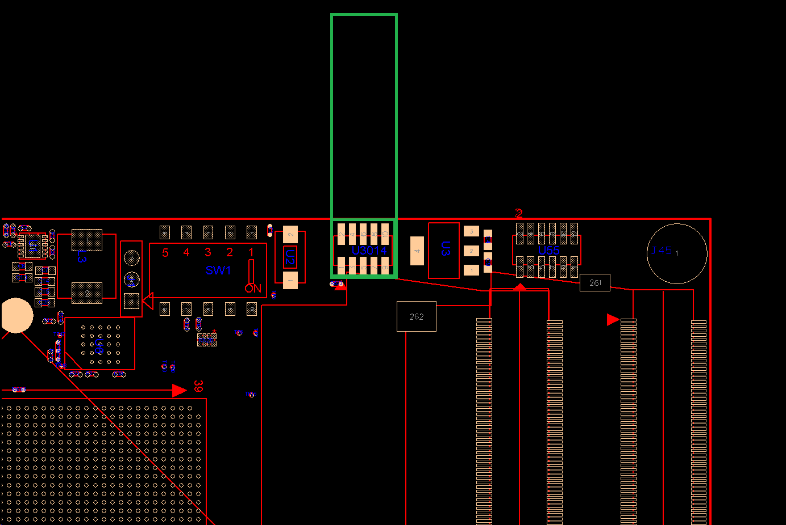
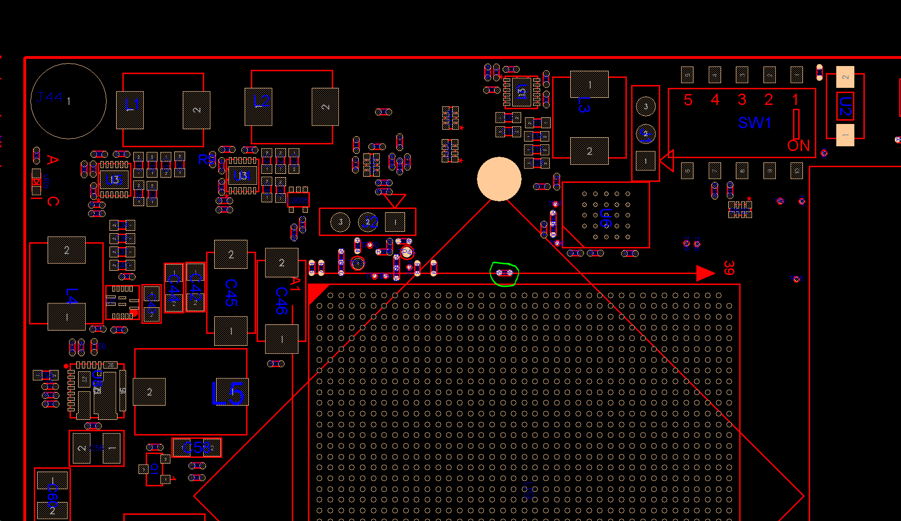
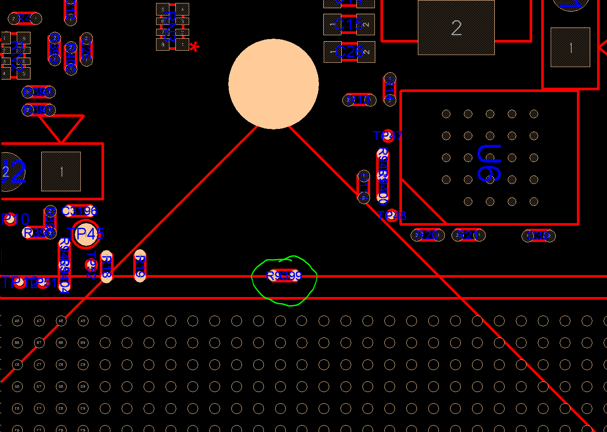
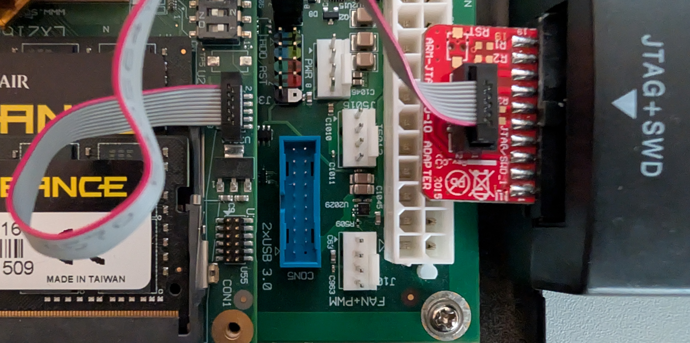
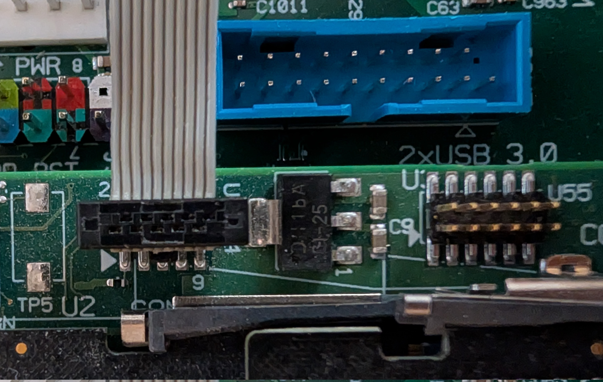

# LX2160A CEX-7 JTAG

The LX2160A COM-Express Type 7 Module provides an ARM CoreSight compatible [10-pin header](https://www.digikey.de/short/9pvb4m4d) (also known as 9-pin Cortex-M) labeled **U3014**, for use with an external debugger such as J-Link, or [NXP's CodeWarrior TAP](https://www.nxp.com/design/design-center/development-boards-and-designs/CW_TAP):

## Decoupling TRST\_B and PORESET\_B

The CEX-7 Module internally connects from PORESET\_B to TRST\_B making it impossible to debug the first stage of boot while RCW is being loaded.

It is possible to remove zero ohm 0402 resistor R9399 which results in TRST\_B floating. It is located below the heat-sink, as shown below:

## Connecting JTAG Adapters

The connection between JTAG and board must not swap any wires. Pin 1 on the JTAG Adapter must go to Pin 1 on the Board (indicated by white arrow) to avoid damaging SoC and the JTAG device. See below the correct orientations for tested adapters:

### ARM 10-Pin Adapter

### Connecting CodeWarrior TAP

.jpg>)

## Using CodeWarrior Software with CodeWarrior TAP

The CodeWarrior TAP can be connected either via Ethernet on the LAN or direct on a USB port.

On the LAN the tap acquires a DHCP lease and responds to hostname "FSLXXYYZZ" where XXYYZZ are the last 3 octets of its MAC address as indicated on the white sticker on the bottom of the tap. E.g. "FSL06BB1D" for tap with mac address "00:04:9F:06:BB:1D".

Within the CodeWarrior Software the TAP is automatically usable when connected over USB. In case of Ethernet / LAN the hostname must be entered to the "Probe Address" Column of "Target connections" UI:

.png>)

## OpenOCD

See [LX2160 JTAG with OpenOCD](lx2160-jtag-with-openocd.md) for details.
