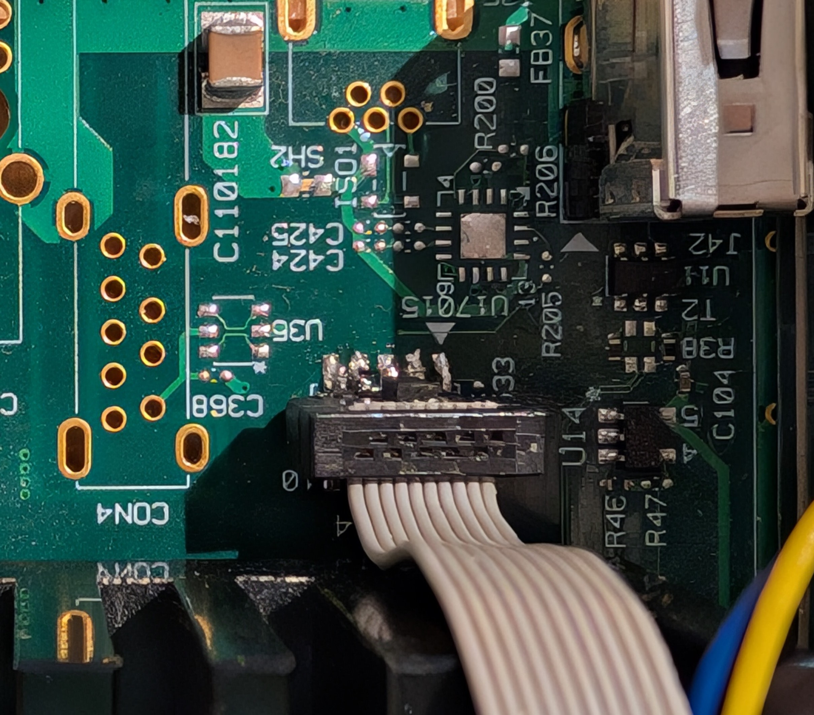

# LX2162A SoM JTAG

The LX2162A System on Module supports the SoC JTAG signals for use with an external debugger such as [NXP’s CodeWarrior TAP](https://www.nxp.com/design/design-center/development-boards-and-designs/CW_TAP). The signals are available on the board-to-board header and access must be facilated by a suitable carrier board.

## Signals on B2B Connector

| 
<strong>ARM CoreSight Connector</strong> <strong>Pin Number</strong>
 | **Name** | **Location** |
| ------------------------------------------------------------------------------ | -------- | ------------ |
| 1                                                                              | VTREF    | J3-15        |
| 2                                                                              | TMS      | J3-10        |
| 4                                                                              | TCK      | J3-12        |
| 6                                                                              | TDO      | J3-22        |
| 8                                                                              | TDI      | J3-16        |
| 10                                                                             | SRST\_N  | J2-19        |

## Decoupling TRST\_B and PORESET\_B

The SoM internally connects from PORESET\_B to TRST\_B making it impossible to debug the first stage of boot while RCW is being loaded.

It is possible to remove 0-Ohm resistor **R9320** from the SoM which results in TRST\_B floating. It is located between eMMC and SPI Flash:

## JTAG Header on Clearfog EVB

The [Clearfog Evaluation board](https://www.solid-run.com/embedded-networking/nxp-lx2160a-family/clearfog-lx2-lite-single-board-computer-sbc/) has soldering pads for an ARM CoreSight compatible [10-pin header](https://www.digikey.de/short/9pvb4m4d) labeled **U3014**:

## Connecting CodeWarrior TAP

### Connector Orientation

The connection between JTAG and board must not swap any wires. Pin 1 on JTAG must go to Pin 1 on the Board (indicated by white arrow) to avoid damaging SoC and the JTAG device. See below the correct orientation for the CodeWarrior TAP to Clearfog EVB:

### Connecting CodeWarrior Software with TAP

The CodeWarrior TAP can be connected either via Ethernet on the LAN or direct on a USB port.

On the LAN the tap acquires a DHCP lease and responds to hostname “FSLXXYYZZ” where XXYYZZ are the last 3 octets of its MAC address as indicated on the white sticker on the bottom of the tap. E.g. “FSL06BB1D” for tap with mac address “00:04:9F:06:BB:1D“.

Within the CodeWarrior Software the TAP is automatically usable when connected over USB. In case of Ethernet / LAN the hostname must be entered to the “Probe Address” Column of “Target connections” UI:

