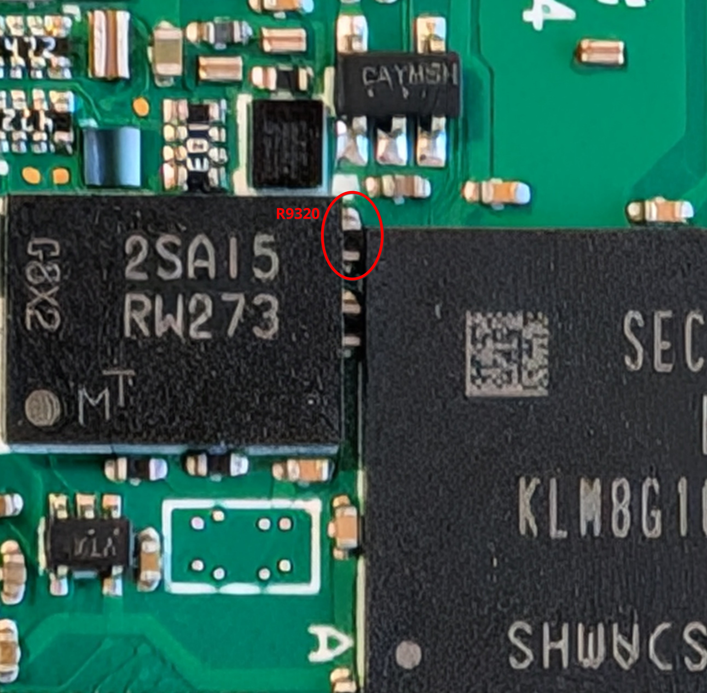
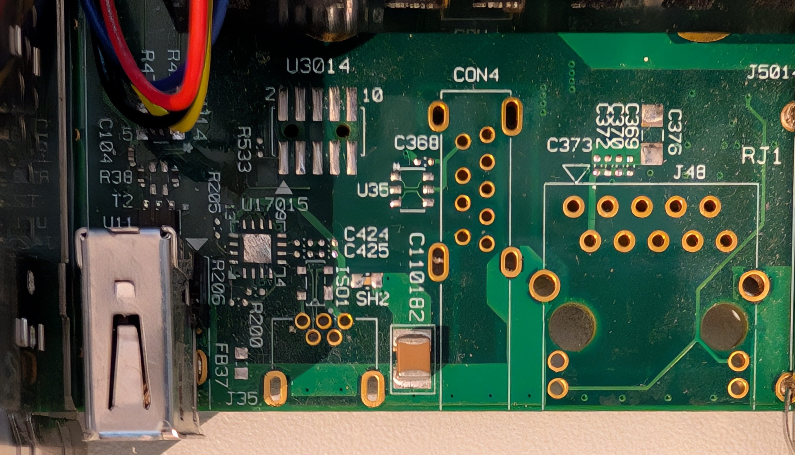
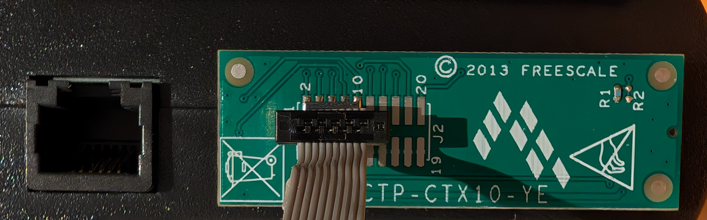
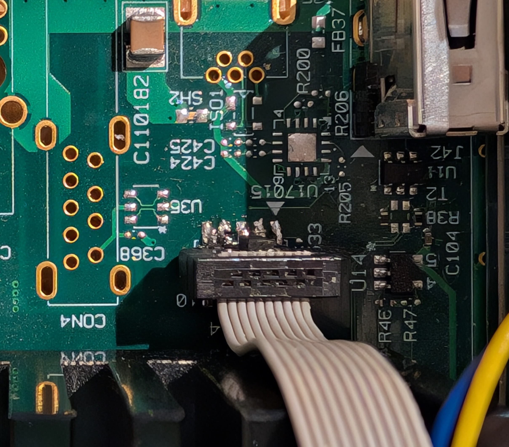
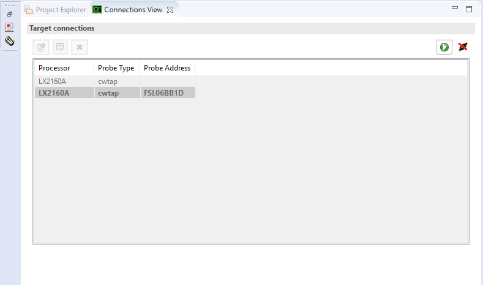

# LX2162A SoM JTAG

The LX2162A System on Module supports the SoC JTAG signals for use with an external debugger such as J-Link, or [NXP's CodeWarrior TAP](https://www.nxp.com/design/design-center/development-boards-and-designs/CW_TAP). The signals are available on the board-to-board header and access must be facilated by a suitable carrier board.

## Signals on B2B Connector

| **ARM CoreSight Connector Pin Number** | **Name** | **Location** |
| --- | --- | --- |
| 1   | VTREF | J3-15 |
| 2   | TMS | J3-10 |
| 4   | TCK | J3-12 |
| 6   | TDO | J3-22 |
| 8   | TDI | J3-16 |
| 10  | SRST\_N | J2-19 |

## Decoupling TRST\_B and PORESET\_B

The SoM internally connects from PORESET\_B to TRST\_B making it impossible to debug the first stage of boot while RCW is being loaded.

It is possible to remove 0-Ohm resistor **R9320** from the SoM which results in TRST\_B floating. It is located between eMMC and SPI Flash:

## JTAG Header on Clearfog EVB

The [Clearfog Evaluation board](https://www.solid-run.com/embedded-networking/nxp-lx2160a-family/clearfog-lx2-lite-single-board-computer-sbc/) has soldering pads for an ARM CoreSight compatible [10-pin header](https://www.digikey.de/short/9pvb4m4d) (also known as 9-pin Cortex-M) labeled **U3014**:

Pin 1 of the connector is supposed to provide the target reference voltage to the JTAG adapter, allowing it to define the correct voltage and not damage the target. This is floating by default, since R533 is not assembled.

Any JTAG Adapter supporting variable voltages should solder either a 0-Ohm or 50-Ohm resistor in the place of R533 as shown on picture above, connecting 1.8V reference voltage to U3015 Pin 1.

## Connecting JTAG Adapters

The connection between JTAG and board must not swap any wires. Pin 1 on the JTAG Adapter must go to Pin 1 on the Board (indicated by white arrow) to avoid damaging SoC and the JTAG device. See below the correct orientations for tested adapters:

### ARM 10-Pin Adapter

### Connecting CodeWarrior TAP

## Using CodeWarrior Software with CodeWarrior TAP

The CodeWarrior TAP can be connected either via Ethernet on the LAN or direct on a USB port.

On the LAN the tap acquires a DHCP lease and responds to hostname "FSLXXYYZZ" where XXYYZZ are the last 3 octets of its MAC address as indicated on the white sticker on the bottom of the tap. E.g. "FSL06BB1D" for tap with mac address "00:04:9F:06:BB:1D".

Within the CodeWarrior Software the TAP is automatically usable when connected over USB. In case of Ethernet / LAN the hostname must be entered to the "Probe Address" Column of "Target connections" UI:

## OpenOCD

See [LX2160 JTAG with OpenOCD](../../../lx2160a/sbc-platform/lx2160a-other-articles/lx2160-jtag-with-openocd.md) for details.
