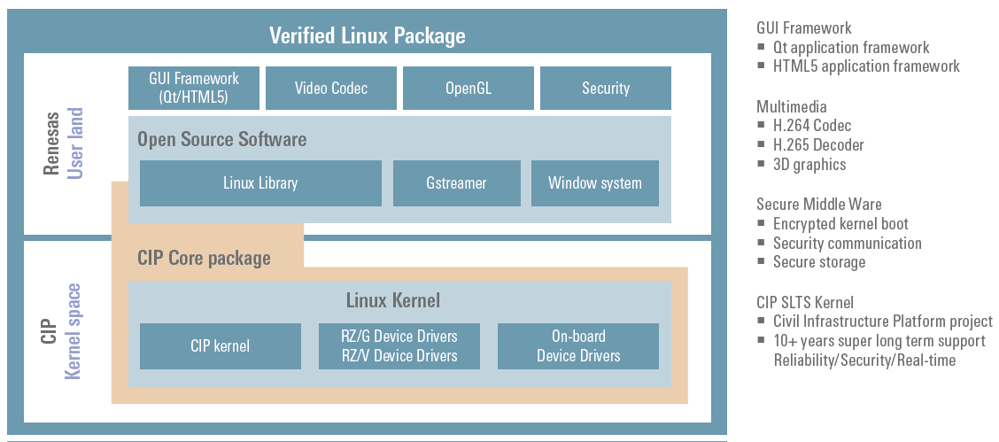
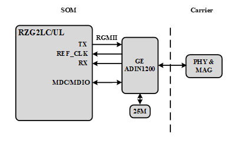
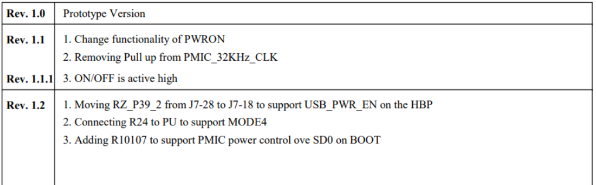

# RZ/G2LC SOM Hardware User Manual

## Revisions and Notes

|                   |                                                                                                                                                                                                                                                                                                                                                                                                                                                                                                                                                                                                                                                                                                                                                                                                                                                                                                                                                                                                                                                                                                                                                                                                                                                                                                                                                                                                                                                                                                                                                                                                                                                                                                                                                                                                                                                                                                                                                                                                                                                                                                                                                                                                                                                                                                                                                                                                                                                                                                                                                                                                                                                                                                                                                                                                                                                                                                                                                                                                                                                                                                                                                                                                                                                                                                                                                                                                                                                                                                                                                                                                                                                                                                                                                                                                                                                                                                                                                                                                                                                                                                                                                                                                                                                                                                                                                       |              |                                                                                                                                                                              |
| ----------------- | ----------------------------------------------------------------------------------------------------------------------------------------------------------------------------------------------------------------------------------------------------------------------------------------------------------------------------------------------------------------------------------------------------------------------------------------------------------------------------------------------------------------------------------------------------------------------------------------------------------------------------------------------------------------------------------------------------------------------------------------------------------------------------------------------------------------------------------------------------------------------------------------------------------------------------------------------------------------------------------------------------------------------------------------------------------------------------------------------------------------------------------------------------------------------------------------------------------------------------------------------------------------------------------------------------------------------------------------------------------------------------------------------------------------------------------------------------------------------------------------------------------------------------------------------------------------------------------------------------------------------------------------------------------------------------------------------------------------------------------------------------------------------------------------------------------------------------------------------------------------------------------------------------------------------------------------------------------------------------------------------------------------------------------------------------------------------------------------------------------------------------------------------------------------------------------------------------------------------------------------------------------------------------------------------------------------------------------------------------------------------------------------------------------------------------------------------------------------------------------------------------------------------------------------------------------------------------------------------------------------------------------------------------------------------------------------------------------------------------------------------------------------------------------------------------------------------------------------------------------------------------------------------------------------------------------------------------------------------------------------------------------------------------------------------------------------------------------------------------------------------------------------------------------------------------------------------------------------------------------------------------------------------------------------------------------------------------------------------------------------------------------------------------------------------------------------------------------------------------------------------------------------------------------------------------------------------------------------------------------------------------------------------------------------------------------------------------------------------------------------------------------------------------------------------------------------------------------------------------------------------------------------------------------------------------------------------------------------------------------------------------------------------------------------------------------------------------------------------------------------------------------------------------------------------------------------------------------------------------------------------------------------------------------------------------------------------------------------------------- | ------------ | ---------------------------------------------------------------------------------------------------------------------------------------------------------------------------- |
| **Date**          | **Owner**                                                                                                                                                                                                                                                                                                                                                                                                                                                                                                                                                                                                                                                                                                                                                                                                                                                                                                                                                                                                                                                                                                                                                                                                                                                                                                                                                                                                                                                                                                                                                                                                                                                                                                                                                                                                                                                                                                                                                                                                                                                                                                                                                                                                                                                                                                                                                                                                                                                                                                                                                                                                                                                                                                                                                                                                                                                                                                                                                                                                                                                                                                                                                                                                                                                                                                                                                                                                                                                                                                                                                                                                                                                                                                                                                                                                                                                                                                                                                                                                                                                                                                                                                                                                                                                                                                                                             | **Revision** | **Notes**                                                                                                                                                                    |
| 23 Nov 2022       | Noam Weidenfeld                                                                                                                                                                                                                                                                                                                                                                                                                                                                                                                                                                                                                                                                                                                                                                                                                                                                                                                                                                                                                                                                                                                                                                                                                                                                                                                                                                                                                                                                                                                                                                                                                                                                                                                                                                                                                                                                                                                                                                                                                                                                                                                                                                                                                                                                                                                                                                                                                                                                                                                                                                                                                                                                                                                                                                                                                                                                                                                                                                                                                                                                                                                                                                                                                                                                                                                                                                                                                                                                                                                                                                                                                                                                                                                                                                                                                                                                                                                                                                                                                                                                                                                                                                                                                                                                                                                                       | 1.0          |                                                                                                                                                                              |
| 15 May 2023       | Yazan Shhady                                                                                                                                                                                                                                                                                                                                                                                                                                                                                                                                                                                                                                                                                                                                                                                                                                                                                                                                                                                                                                                                                                                                                                                                                                                                                                                                                                                                                                                                                                                                                                                                                                                                                                                                                                                                                                                                                                                                                                                                                                                                                                                                                                                                                                                                                                                                                                                                                                                                                                                                                                                                                                                                                                                                                                                                                                                                                                                                                                                                                                                                                                                                                                                                                                                                                                                                                                                                                                                                                                                                                                                                                                                                                                                                                                                                                                                                                                                                                                                                                                                                                                                                                                                                                                                                                                                                          | 1.1          | SOM step file uploaded                                                                                                                                                       |
| Nov 2, 2023       | Shahar Fridman                                                                                                                                                                                                                                                                                                                                                                                                                                                                                                                                                                                                                                                                                                                                                                                                                                                                                                                                                                                                                                                                                                                                                                                                                                                                                                                                                                                                                                                                                                                                                                                                                                                                                                                                                                                                                                                                                                                                                                                                                                                                                                                                                                                                                                                                                                                                                                                                                                                                                                                                                                                                                                                                                                                                                                                                                                                                                                                                                                                                                                                                                                                                                                                                                                                                                                                                                                                                                                                                                                                                                                                                                                                                                                                                                                                                                                                                                                                                                                                                                                                                                                                                                                                                                                                                                                                                        | 1.2          | Add Power Consumption Measurement                                                                                                                                            |
| 17 Jan 2024       | Yazan Shhady                                                                                                                                                                                                                                                                                                                                                                                                                                                                                                                                                                                                                                                                                                                                                                                                                                                                                                                                                                                                                                                                                                                                                                                                                                                                                                                                                                                                                                                                                                                                                                                                                                                                                                                                                                                                                                                                                                                                                                                                                                                                                                                                                                                                                                                                                                                                                                                                                                                                                                                                                                                                                                                                                                                                                                                                                                                                                                                                                                                                                                                                                                                                                                                                                                                                                                                                                                                                                                                                                                                                                                                                                                                                                                                                                                                                                                                                                                                                                                                                                                                                                                                                                                                                                                                                                                                                          | 1.3          | 
Add SOM Rev 1.2 changes:  - Moving RZ_P39_2 from J7[28] to J7[18] to support USB_PWR_EN on HBP  - Change the voltage level of the MD0-MD2 from 1V8 to 3V3
 |
| 18 Nov 2024       | Yazan Shhady                                                                                                                                                                                                                                                                                                                                                                                                                                                                                                                                                                                                                                                                                                                                                                                                                                                                                                                                                                                                                                                                                                                                                                                                                                                                                                                                                                                                                                                                                                                                                                                                                                                                                                                                                                                                                                                                                                                                                                                                                                                                                                                                                                                                                                                                                                                                                                                                                                                                                                                                                                                                                                                                                                                                                                                                                                                                                                                                                                                                                                                                                                                                                                                                                                                                                                                                                                                                                                                                                                                                                                                                                                                                                                                                                                                                                                                                                                                                                                                                                                                                                                                                                                                                                                                                                                                                          | 1.4          | Updated the documentation to reflect the eMMC speed mode as **HighSpeed**                                                                                                    |
| Table of Contents | 
- <a href="rz-g2lc-som-hardware-user-manual.md#revisions-and-notes">Revisions and Notes</a> - <a href="rz-g2lc-som-hardware-user-manual.md#introduction">Introduction</a> - <a href="rz-g2lc-som-hardware-user-manual.md#overview">Overview</a> - <a href="rz-g2lc-som-hardware-user-manual.md#highlighted-features">Highlighted Features</a> - <a href="rz-g2lc-som-hardware-user-manual.md#supporting-products">Supporting Products</a> - <a href="rz-g2lc-som-hardware-user-manual.md#description">Description</a> - <a href="rz-g2lc-som-hardware-user-manual.md#block-diagram">Block Diagram</a> - <a href="rz-g2lc-som-hardware-user-manual.md#features-summary">Features Summary</a> - <a href="rz-g2lc-som-hardware-user-manual.md#core-system-components">Core System Components</a> - <a href="rz-g2lc-som-hardware-user-manual.md#rz-g2lc-soc">RZ/G2LC SoC</a> - <a href="rz-g2lc-som-hardware-user-manual.md#memories">MEMORIES</a> - <a href="rz-g2lc-som-hardware-user-manual.md#ddr4">DDR4</a> - <a href="rz-g2lc-som-hardware-user-manual.md#emmc-and-sd-nand-memory">eMMC and SD NAND Memory</a> - <a href="rz-g2lc-som-hardware-user-manual.md#micro-sd-carrier">Micro-SD (Carrier)</a> - <a href="rz-g2lc-som-hardware-user-manual.md#quad-serial-nor-flash-som">Quad Serial NOR Flash (SOM)</a> - <a href="rz-g2lc-som-hardware-user-manual.md#eeprom-som">EEPROM (SOM)</a> - <a href="rz-g2lc-som-hardware-user-manual.md#serial-nor-flash-carrier">Serial NOR Flash (Carrier)</a> - <a href="rz-g2lc-som-hardware-user-manual.md#10-100-mbps-ethernet-phy">10/100 Mbps Ethernet PHY</a> - <a href="rz-g2lc-som-hardware-user-manual.md#wi-fi-80211a-b-g-n-and-bt-52-muratas-certified-module">WI-FI (802.11A/B/G/N) AND BT 5.2 (MURATA'S CERTIFIED MODULE)</a> - <a href="rz-g2lc-som-hardware-user-manual.md#wi-fi-bt">WI-FI &#x26; BT</a> - <a href="rz-g2lc-som-hardware-user-manual.md#external-interfaces">External Interfaces</a> - <a href="rz-g2lc-som-hardware-user-manual.md#general">General</a> - <a href="rz-g2lc-som-hardware-user-manual.md#usb-20">USB-2.0</a> - <a href="rz-g2lc-som-hardware-user-manual.md#mipi-csi">MIPI CSI</a> - <a href="rz-g2lc-som-hardware-user-manual.md#mipi-dsi">MIPI DSI</a> - <a href="rz-g2lc-som-hardware-user-manual.md#audio">Audio</a> - <a href="rz-g2lc-som-hardware-user-manual.md#uart">UART</a> - <a href="rz-g2lc-som-hardware-user-manual.md#spi">SPI</a> - <a href="rz-g2lc-som-hardware-user-manual.md#i2c">I2C</a> - <a href="rz-g2lc-som-hardware-user-manual.md#usd">uSD</a> - <a href="rz-g2lc-som-hardware-user-manual.md#can-fd">CAN-FD</a> - <a href="rz-g2lc-som-hardware-user-manual.md#connectors-signal-description">CONNECTOR’S SIGNAL DESCRIPTION</a> - <a href="rz-g2lc-som-hardware-user-manual.md#j5001">J5001</a> - <a href="rz-g2lc-som-hardware-user-manual.md#j7">J7</a> - <a href="rz-g2lc-som-hardware-user-manual.md#j9">J9</a> - <a href="rz-g2lc-som-hardware-user-manual.md#som-revision-and-notes">SOM Revision and Notes</a> - <a href="rz-g2lc-som-hardware-user-manual.md#mikrobus">mikroBUS</a> - <a href="rz-g2lc-som-hardware-user-manual.md#power-reset">Power &#x26; Reset</a> - <a href="rz-g2lc-som-hardware-user-manual.md#power-consumption">Power Consumption</a> - <a href="rz-g2lc-som-hardware-user-manual.md#reset">RESET</a> - <a href="rz-g2lc-som-hardware-user-manual.md#rzg2lc-ul-integration-manual">RZG2LC/UL INTEGRATION MANUAL</a> - <a href="rz-g2lc-som-hardware-user-manual.md#power-up-sequence">POWER UP SEQUENCE</a> - <a href="rz-g2lc-som-hardware-user-manual.md#booting-options">BOOTING OPTIONS</a> - <a href="rz-g2lc-som-hardware-user-manual.md#strap-pins-booting">Strap pins Booting</a> - <a href="rz-g2lc-som-hardware-user-manual.md#i2c-interfaces">I2C INTERFACES</a> - <a href="rz-g2lc-som-hardware-user-manual.md#gpio-interfaces">GPIO INTERFACES</a> - <a href="rz-g2lc-som-hardware-user-manual.md#mechanical-description">Mechanical Description</a> - <a href="rz-g2lc-som-hardware-user-manual.md#documentation">Documentation</a> - <a href="rz-g2lc-som-hardware-user-manual.md#related-articles">Related Articles</a>
 |              |                                                                                                                                                                              |

## Introduction

This User Manual relates to the SolidRun’s RZG2 series, which includes

* RZG2LC Dual core ARM A55 (1.2GHz) w Cortex-M33 (200MHz)
* RZG2UL Single core ARM A55 (1.0GHz) w Cortex-M33 (200MHz)

## Overview

The SolidRun’s RZ/G2LC family is a high-performance 64-Bit Renesas RZ/G2 Based SOMs with Integrated GPU for Next-Gen Human-Machine Interfaces.

Ideal for automation, smart buildings, network cameras, and IoT devices, SolidRun RZ/G2 SOMs combine a powerful MPU, GPU, extended ECC, Ethernet, and offer long-term Linux software support.

#### Highlighted Features

* Ultra-small footprint SOM (47x30mm) including three board-to-board connectors (250 total pins number).
* Renesas’s SoC supports Solo and DUAL versions.
* Up to Dual Cortex A55 and up to 1.2GHz
* Cortex-M33 subsystem processor supports real time tasks.
* High security engines.
* A single Ethernet interfaces.
* Up to two CAN interfaces.
* High industrial reliability with in-line ECC on DDR4 and on on-chip RAM.
* Single MIPI-CSI and single MIPI-DSI (NO encoder/decoder)
* Two USB 2.0.
* DDR4 memory in x16 configurations supports up to 2GB and up to 3.2GT/s.
* Up to 64GB eMMC (**HighSpeed Mode**, up to 52MHz).
* Wi-Fi 11b/g/n + Bluetooth 5.2 certified module
* 1Mb QSPI NOR Flash
* 1Kb I2C EEPROM
* Real time Clock and a rechargeable battery
* Power management devices
* Commercial and industrial temperature grade support.

#### Supporting Products

The following products are provided from SolidRun both as production level platforms and as reference examples on how to incorporate the SOM in different levels of integration:

* [HummingBoard Ripple](hummingboard-ripple-rz-g2lc-som-quick-start-guide.md) – A board computer that incorporates the SOM retains the same Android and different Linux distributions while adding extra hardware functionalities and access to the hardware.

## Description

#### Block Diagram

The following figure describes the RZ/G2LC Blocks Diagram.

#### Features Summary

Following are the features summary of the SOM. Notice that some of the features are pinout multiplexed (please refer to the pin mux table below and the Renesas’s data sheets):

* Renesas’s RZG2 series SoC (Dual/Single ARM® Cortex™ A55 Processor, up to 1.2 GHz)
* Cortex-M33 (200MHz) subsystem processor.
* Up to 2GByte DDR4 memory and up to 3.2GT/s
* Eight bits eMMC 5.1 (HS Speed Mode) memory or a four bits SD interface
* 1Kb I2C EEPROM.
* 8Mb QSPI NOR Flash
* 4-lanes MIPI-DSI interface
* 4-lanes MIPI CSI-2
* Single 10/100 Mbps Ethernet PHY
* Wi-Fi (802.11a/b/g/n) + BT (5.2) Murata's certified module
* Two USB 2.0 Host and Device
* Single eSPI interface.
* Up to four Serial interfaces.
* Up to 2 CAN-FD.
* RTC w a rechargeable battery
* Power:

o A single 5.0V input using B-t-B connector

o 3.3V/1A output to support carrier's digital interfaces.

o 1.2V/0.5A output

o RAA215300 PMIC

## Core System Components

#### RZ/G2LC SoC

Ideal for automation, smart buildings, network cameras, and IoT devices, SolidRun RZ/G2 SOMs combine a powerful MPU, GPU, extended ECC, Ethernet, and offer long-term Linux software support.

A verified Linux Package (VLP) reduces cost and simplifies design

#### MEMORIES

The RZG2L SOM supports varieties of memory interfaces for booting and data storage. The following figure describes the RZG2L memory interfaces.

#### DDR4

* Up to 2GB memory space.
* 16 Bits data bus.
* Up to 3600 MT/s.
* ECC function for single-bit and double-bit error reporting, single-bit error correction, and programmable removal of ECC storage
* Support various low power modes, clock, and power gated operation.
* Support Self-Refresh mode.

#### **eMMC and SD NAND Memory**

SD0 of the RZG2LC/UL can be configured as an 8-bit eMMC interface or a 4-bit SDIO. Configuration can be done during the boot process (Boot strap pins) or by SW.

Selecting SD0’s physical connection (eMMC or uSD card) is done by an analog switch.


The state of the analog switch can be set by a DIP-Switch, SW or PU/PD resistors.


&#x20;**eMMC**

* Up to 64GB memory space
* 8 Bits data bus.
* Support MMC standard, up to version 4.5.1.
* Supports **High-speed** **Mode** (up to 52MHz)
* uSDHC-0.
* Can be used as BOOT NVM \*\*

#### **Micro-SD (Carrier)**

* Optional on the carrier board
* uSDHC-0.
* Implements 4 data bits.
* Support SD/SDIO standard up to version 3.0.
* SD, SDHC, and SDXC SD memory card access supported.
* Default, high-speed, UHS-I/SDR50, and SDR104 transfer modes supported
* Can be used as BOOT NVM \*\*

#### **Quad Serial NOR Flash (SOM)**

* Each channel can be configured as a 1/2/4-bit operation.
* Support both SDR (66MHz) mode and DDR (50MHz) mode
* No reset
* QSPIA/nSS0.
* Can be used as BOOT NVM \*\*

#### **EEPROM (SOM)**

* 1Kb EEPROM
* ON-Semi’s CAT24AA01TDI or compatible
* I2C0
* Address 0X50 (7 bits format)
* Stores SOM’s configurations.

#### **Serial NOR Flash (Carrier)**

* Optional on carrier board
* 1 bit data bus.
* eSPI1/nSS0
* Can be used as BOOT NVM \*


**\* Note – eMMC and uSD share the same signals.** **\*\* Note – Boot configuration is set by the Boot-strap pins**


#### **10/100 Mbps Ethernet PHY**

&#x20;The SOM supports single fast Ethernet interfaces.

* RGMII interface.
* 802.3 Ethernet interface for 100BASE-TX, and10BASE-T.
* Analog Device's ADIN1200 PHY.
* EEE in accordance with IEEE 802.3az
* Start of packet detection for IEEE 1588 timestamp support
* 139 mW for 100BASE-TX

#### WI-FI (802.11A/B/G/N) AND BT 5.2 (MURATA'S CERTIFIED MODULE)

#### **WI-FI & BT**

&#x20;The WI-FI & BT module is Murata’s 1YN module Based on Cypress CYW43439W. hip. The WI-FI main features are:

* Operate at ISM frequency Band (2.4)
* IEEE Standards Support 802.11a, 802.11b, 802.11g and 802.11n
* WI-FI over SDIO-1 interface
* BT 5.2 BR/EDR/LE
* BT over UART-2 Interface
* Global certification.

## External Interfaces

#### General

The SOM incorporates three Hirose DF40 board-to-board headers.

The selection of the Hirose DF40 is due to the following criteria:

* Miniature (0.4m pitch)
* Highly reliable manufacturer
* Availability (worldwide distribution channels)
* Excellent signal integrity (supports 6Gbps)
  * Please contact Hirose or SolidRun for reliability and test result data.
* Mating height of between 1.5mm to 4.0mm (1.5mm to 3.0mm if using 70-pin Board-to-Board header). RZG2LC/UL SOM’s headers are fixed, the final mating height is determined by carrier implementation

#### USB-2.0

The RZG2LC/UL supports two USB2.0 interfaces. The following figure describes the USB interfaces.

The USB’s main features are:

* Single USB 2.0 OTG/DRD(Host/Function) interface (USB0)
* Single USB 2.0 Host interface (USB1).
* Support mode: High-Speed(480Mbps)/Full-Speed(12Mbps)/Low-Speed(1.5Mbps).
* OTG function (Rev2.0).
* Battery Charging function.
* B2B Connector’s Signal Description
* DRD(Dual-Role-Device) function (Static switch between Host and Function).
* Power control signals are not part of the USB module, any available GPIO can be used.


**Note – The voltage on VBUS is 5V.**


#### MIPI CSI

The following figure describes the CSI interface.

* Supports MIPI CSI-2 V2.1 and MIPI D-PHY V2.1 (80 Mbps \~ 1500 Mbps)..
* Maximum image size: 5 M pixels.
* Minimum image size: QVGA (320 × 240) ＝ 76.8 K pixels.
* Maximum number of valid pixels in the horizontal direction: 2800 pixels.
* Maximum number of valid pixels in the vertical direction: 4095 lines
* Support 1/2/4 lanes.
* Support 4 Virtual Channel.

#### MIPI DSI

The following figure describes the DSI interface.

The DSI main features are:

* Display Serial Interface Version 1.3.1.
* Support up to Full HD (1920 × 1080), 60 fps (RGB888).
* Maximum Bandwidth: 1.5 Gbps per lane, 4 data lanes.
* Support Output Data Format: RGB666 / RGB888.
* Supports 1, 2, 3 and 4 lane configurations.
* Support for Virtual Channel

#### Audio

Up to 3 serial sound interface (SSIF-2) transmits and receives audio data to and from various devices that are compatible with I2S format, monaural format and TDM format.

The Audio main features are:

* Master/slave
* Full-duplex communication is available in interfaces 0, 1.
* Half-duplex communication is only available in interface 2.
* I2S format, Monaural format and TDM format.
* MSB first, data can be left-justified or right-justified.


Note – Audio Clock signal is an input, should be provided by the carrier board.



Note – Some of the signals are multiplexed with other functionalities. Check datasheet for more information.


#### UART

Up to 4 UART interfaces. The following figure describes the UART interfaces.

The UART interface's main features are:

* UART 2 is connected directly to the WI-FI/BT Modem to support the BT. It is available on the SOM B-t-B connector When the WIFI is not assembled.
* UART 0 supports TX, RX and is used as terminal interface
* UART 1 supports TX, RX, CTS and RTS.
* UART 3 supports TX and RX.
* Selectable bit rate with an on-chip baud rate generator.


**Note – UART interfaces are available as ALT functional signals of other signals.**


#### SPI

Up to 3 SPI interfaces. The following figure describes the eSPI interface.

* Single chip select nSS0.
* Master/Slave configurable.
* Switching of the polarity of the serial transfer clock.
* Switching of the clock phase of serial transfer.
* Transfer bit-length is selectable as 8, 16, or 32 bits.


**Note UART interfaces are available as ALT functional signals of other signals.**


#### I2C

Up to 4 I2C Interfaces. The following figure describes the I2C interfaces.

The I2C main features are:

* I2C-2 is used only on the SOM. It is connected to the PMIC.
* I2C-0 is available on the connector and connected to the SOM’s EEPROM.
* I2C-1 and I2C3 are available on the BtB connectors.
* I2C bus format or SMBus format.
* Master mode or slave mode selectable
* Up to 1 Mbps.
* Up to three slave-address settings can be made.
* Internal time-out function is capable of detecting long-interval stop of the SCL (clock signal).


**Note – I2C interfaces are available as ALT functional signals of other signals.**


#### uSD

The uSD interface is multiplexed with the eMMC interface. Only one of them is available.

#### CAN-FD

Up to 2 CANFD interfaces are available. The following figure describes the CAN interfaces.

The CAN main features are:

* Supports two interface modes, classical CAN mode and CANFD mode.
* ISO11898-1 compliant.
* Maximum 1 Mbps in classical CAN mode.
* Nominal bit rate: max.1 Mbps, data bit rate: max. 4 Mbps in CANFD mode.

## CONNECTOR’S SIGNAL DESCRIPTION

#### J5001

| **PIN** | **HBP 2.5**               |          | **RZG2LC 1.2**    |     |   | **PIN** | **HBP 2.5**               |     | **RZG2LC 1.2**          |                                               |
| ------- | ------------------------- | -------- | ----------------- | --- | - | ------- | ------------------------- | --- | ----------------------- | --------------------------------------------- |
| 1       | TP4                       | 1V8      | NC                |     |   | 2       | NC                        |     | NC                      |                                               |
| 3       | DIP-SWITCH                | 1V8/ 3V3 | MD0               | 3V3 |   | 4       | DSI-CON (J19) or DSI-HDMI |     | RZ\_DSI\_DATA3\_N       |                                               |
| 5       | DIP-SWITCH                | 1V8/ 3V3 | MD1               | 3V3 |   | 6       | DSI-CON (J19) or DSI-HDMI |     | RZ\_DSI\_DATA3\_P       |                                               |
| 7       | GND                       |          | GND               |     |   | 8       | GND                       |     | GND                     |                                               |
| 9       | DSI-CON (J19) or DSI-HDMI |          | RZ\_DSI\_CLK\_P   |     |   | 10      | GND                       |     | GND                     |                                               |
| 11      | DSI-CON (J19) or DSI-HDMI |          | RZ\_DSI\_CLK\_N   |     |   | 12      | DSI-CON (J19) or DSI-HDMI |     | RZ\_DSI\_DATA0\_N       |                                               |
| 13      | GND                       |          | GND               |     |   | 14      | DSI-CON (J19) or DSI-HDMI |     | RZ\_DSI\_DATA0\_P       |                                               |
| 15      | DSI-CON (J19) or DSI-HDMI |          | RZ\_DSI\_DATA2\_N |     |   | 16      | GND                       |     | GND                     |                                               |
| 17      | DSI-CON (J19) or DSI-HDMI |          | RZ\_DSI\_DATA2\_P |     |   | 18      | Mini-PCIe (J20, optional) |     | NC                      |                                               |
| 19      | GND                       |          | GND               |     |   | 20      | Mini-PCIe (J20, optional) |     | NC                      |                                               |
| 21      | DSI-CON (J19) or DSI-HDMI |          | RZ\_DSI\_DATA1\_N |     |   | 22      | GND                       |     | GND                     |                                               |
| 23      | DSI-CON (J19) or DSI-HDMI |          | RZ\_DSI\_DATA1\_P |     |   | 24      | M.2\_W\_DIS#              | 1V8 | NC                      |                                               |
| 25      | GND                       |          | GND               |     |   | 26      | Mini-PCIe\_W\_DIS#        | 3V3 | NC                      |                                               |
| 27      | M.2\_WAKW\_ON\_LAN (PCIe) | NA       | NC                |     |   | 28      | USB1\_PWR\_EN             | 3V3 | RZ\_DSI\_DATA0\_P       | 3V3                                           |
| 29      | MIKROBUS (J10-4)          | NA       | RZ\_SCIF1\_TXD    | 3V3 |   | 30      | GND                       |     | GND                     |                                               |
| 31      | MIKROBUS (J10-3)          | NA       | RZ\_SCIF1\_RXD    | 3V3 |   | 32      | Mini-PCIe (J20, optional) |     | NC                      |                                               |
| 33      | GND                       |          | GND               |     |   | 34      | Mini-PCIe (J20, optional) |     | NC                      |                                               |
| 35      | NC                        |          | NC                |     |   | 36      | GND                       |     | GND                     |                                               |
| 37      | MIKROBUS (J10-1)          | NA       | RZ\_SCIF1\_CTS    | 3V3 |   | 38      | Mini-PCIe (J20, optional) |     | NC                      |                                               |
| 39      | MIKROBUS (J10-2)          | NA       | RZ\_SCIF1\_RTS    | 3V3 |   | 40      | Mini-PCIe (J20, optional) |     | NC                      |                                               |
| 41      | HEADER, DIP-SW            | 3V3      | MD2               | 3V3 |   | 42      | GND                       |     | GND                     |                                               |
| 43      | DSI\_TS\_nINT (DSI-HDMI)  | 3V3      | RZ\_P42\_2        | 3V3 |   | 44      | LED (D34)                 | 3V3 | RZ\_SCIF2\_RX/WIFI\&BT  | 3V3. I/O available when WIFI/BT Not assembled |
| 45      | NC                        |          | NC                |     |   | 46      | LED (D33)                 | 3V3 | RZ\_SCIF2\_TX/WIFI\&BT  | 3V3. I/O available when WIFI/BT Not assembled |
| 47      | GND                       |          | GND               |     |   | 48      | LED (D32)                 | 3V3 | RZ\_SCIF2\_CTS/WIFI\&BT | 3V3. I/O available when WIFI/BT Not assembled |
| 49      | NC                        |          | NC                |     |   | 50      | LED (D31)                 | 3V3 | RZ\_SCIF2\_RTS/WIFI\&BT | 3V3. I/O available when WIFI/BT Not assembled |
| 51      | HEADER, DIP-SW            | 3V3      | NC                |     |   | 52      | GND                       |     | GND                     |                                               |
| 53      | WIFI\_DP (HUB to IMX8M)   | NA       | NC                |     |   | 54      | CSI-CON(CON7)             |     | RZ\_CSI\_DATA0\_N       |                                               |
| 55      | WIFI\_DN (HUB to IMX8M)   | NA       | NC                |     |   | 56      | CSI-CON(CON7)             |     | RZ\_CSI\_DATA0\_P       |                                               |
| 57      | GND                       |          | GND               |     |   | 58      | GND                       |     | GND                     |                                               |
| 59      | CSI-CON(CON7)             |          | RZ\_CSI\_CLK\_P   |     |   | 60      | CSI-CON(CON7)             |     | RZ\_CSI\_DATA2\_P       |                                               |
| 61      | CSI-CON(CON7)             |          | RZ\_CSI\_CLK\_N   |     |   | 62      | CSI-CON(CON7)             |     | RZ\_CSI\_DATA2\_N       |                                               |
| 63      | GND                       |          | GND               |     |   | 64      | GND                       |     | GND                     |                                               |
| 65      | CSI-CON(CON7)             |          | RZ\_CSI\_DATA3\_P |     |   | 66      | CSI-CON(CON7)             |     | RZ\_CSI\_DATA1\_P       |                                               |
| 67      | CSI-CON(CON7)             |          | RZ\_CSI\_DATA3\_N |     |   | 68      | CSI-CON(CON7)             |     | RZ\_CSI\_DATA1\_N       |                                               |
| 69      | GND                       |          | GND               |     |   | 70      | GND                       |     | GND                     |                                               |

#### J7

| **PIN** | **HBP 2.5**          |     | **RZG2LC 1.2** |     |   | **PIN** | **HBP 2.5**               |     | **RZG2LC 1.2**  |                                          |
| ------- | -------------------- | --- | -------------- | --- | - | ------- | ------------------------- | --- | --------------- | ---------------------------------------- |
| 1       | ETH\_NIC (Intel, U6) |     | NC             |     |   | 2       | ETH\_NIC (Intel, U6)      |     | NC              |                                          |
| 3       | ETH\_NIC (Intel, U6) |     | NC             |     |   | 4       | ETH\_NIC (Intel, U6)      |     | NC              |                                          |
| 5       | GND                  |     | GND            |     |   | 6       | GND                       |     | GND             |                                          |
| 7       | ETH\_NIC (Intel, U6) |     | NC             |     |   | 8       | HEADER (CON4)             | NA  | NC              |                                          |
| 9       | ETH\_NIC (Intel, U6) |     | NC             |     |   | 10      | mPCIe (J20)               | 3V3 | RZ\_P19\_1      | 3V3                                      |
| 11      | GND                  |     | GND            |     |   | 12      | HEADER (CON4)             | NA  | NC              |                                          |
| 13      | M.2\_RESET#          | 1V8 | RZ\_P19\_0     | 3V3 |   | 14      | POE\_AT\_DET              | 3V3 | NC              |                                          |
| 15      | RTC\_CLKO (RTC Int.) | 3V3 | NC             |     |   | 16      | DSI-CON (J19) or DSI-HDMI | NA  | NC              |                                          |
| 17      | GND                  |     | GND            |     |   | 18      | M.2\_PCIe\_3V3\_EN        | 3V3 | RZ\_P39\_2      | 3V3                                      |
| 19      | HDMI CON (J1)        |     | NC             |     |   | 20      | HEADER (CON4)             | NA  | NC              |                                          |
| 21      | HDMI CON (J1)        |     | NC             |     |   | 22      | HEADER (CON4)             | NA  | NC              |                                          |
| 23      | GND                  |     | GND            |     |   | 24      | HEADER (CON4)             | NA  | NC              |                                          |
| 25      | HDMI CON (J1)        |     | NC             |     |   | 26      | USB-HUB\_RST#             | 3V3 | RZ\_P39\_1      | 3V3                                      |
| 27      | HDMI CON (J1)        |     | NC             |     |   | 28      | HEADER (CON4)             | NA  | NC              | (Now NC - was RZ\_P39\_2 in SOM Rev 1.1) |
| 29      | GND                  |     | GND            |     |   | 30      | HEADER (CON4)             | NA  | NC              |                                          |
| 31      | HDMI CON (J1)        |     | NC             |     |   | 32      | TP6                       |     | NC              |                                          |
| 33      | HDMI CON (J1)        |     | NC             |     |   | 34      | NC                        |     | NC              |                                          |
| 35      | GND                  |     | GND            |     |   | 36      | HEADER (CON4)             | NA  | NC              |                                          |
| 37      | HDMI CON (J1)        |     | NC             |     |   | 38      | CSI-CON(CON7)             | NA  | RZ\_SCIF3\_TXD  | 3V3                                      |
| 39      | HDMI CON (J1)        |     | NC             |     |   | 40      | NC                        |     | NC              |                                          |
| 41      | GND                  |     | GND            |     |   | 42      | GND                       |     | GND             |                                          |
| 43      | HDMI CON (J1)        | 3V3 | NC             |     |   | 44      | LED (D30)                 | 3V3 | RZ\_SCIF3\_RXD  | 3V3                                      |
| 45      | HDMI CON (J1)        | 5V  | NC             |     |   | 46      | HEADER (CON4)             | NA  | NC              |                                          |
| 47      | HDMI CON (J1)        | 5V  | NC             |     |   | 48      | GND                       |     | GND             |                                          |
| 49      | HDMI CON (J1)        | 5V  | NC             |     |   | 50      | HEADER (CON4)             | NA  | NC              |                                          |
| 51      | AUDIO CODEC          | 3V3 | RZ\_SSI0\_BCK  | 3V3 |   | 52      | TERMINAL\_TX              | 3V3 | RZ\_SCIF0\_TXD  | 3V3                                      |
| 53      | AUDIO CODEC          | 3V3 | RZ\_SSI0\_TXD  | 3V3 |   | 54      | TERMINAL\_RX              | 3V3 | RZ\_SCIF0\_RXD  | 3V3                                      |
| 55      | AUDIO CODEC          | 3V3 | RZ\_SSI0\_RCK  | 3V3 |   | 56      | NC                        |     | NC              |                                          |
| 57      | AUDIO CODEC          | 3V3 | RZ\_SSI0\_RXD  | 3V3 |   | 58      | GND                       |     | GND             |                                          |
| 59      | AUDIO CODEC          | 3V3 | AUDIO\_CLK1    | 3V3 |   | 60      | USB-HUB                   |     | NC              |                                          |
| 61      | GND                  |     | GND            |     |   | 62      | USB-HUB                   |     | NC              |                                          |
| 63      | HEADER (CON4)        | NA  | NC             |     |   | 64      | GND                       |     | GND             |                                          |
| 65      | RESET-B              | 1V8 | SYS\_nRST      | 1V8 |   | 66      | USB-HUB                   |     | NC              |                                          |
| 67      | HEADER (CON4)        | NA  | NC             |     |   | 68      | USB-HUB                   |     | NC              |                                          |
| 69      | HEADER (CON4)        | NA  | NC             |     |   | 70      | GND                       |     | GND             |                                          |
| 71      | HEADER (CON4)        | NA  | SD1\_PWR\_SEL  | 3V3 |   | 72      | HEADER (CON4)             | NA  | RZ\_RSPI0\_MISO | 3V3                                      |
| 73      | MICRO-SD             | NA  | NC             |     |   | 74      | HEADER (CON4)             | NA  | RZ\_RSPI0\_MOSI | 3V3                                      |
| 75      | GND                  |     | GND            |     |   | 76      | GND                       |     | GND             |                                          |
| 77      | HDMI CON (J1)        |     | VDD\_1V2       | 1V2 |   | 78      | HEADER (CON4)             | NA  | RZ\_RSPI0\_SSL  | 3V3                                      |
| 79      | HDMI CON (J1)        |     | VDD\_1V2       | 1V2 |   | 80      | HEADER (CON4)             | NA  | RZ\_RSPI0\_CK   | 3V3                                      |

#### J9

| **PIN** | **HBP 2.5**                                        |     | **RZG2LC 1.2**   |     |   | **PIN** | **HBP 2.5**                  |     | **RZG2LC 1.2**      |     |
| ------- | -------------------------------------------------- | --- | ---------------- | --- | - | ------- | ---------------------------- | --- | ------------------- | --- |
| 1       | ETH-POE                                            |     | NC               |     |   | 2       | GND                          |     | GND                 |     |
| 3       | ETH-POE                                            |     | NC               |     |   | 4       | USB-TYPE-A                   |     | NC                  |     |
| 5       | GND                                                |     | GND              |     |   | 6       | USB-TYPE-A                   |     | NC                  |     |
| 7       | ETH-POE                                            |     | NC               |     |   | 8       | GND                          |     | GND                 |     |
| 9       | ETH-POE                                            |     | NC               |     |   | 10      | USB-TYPE-A                   |     | NC                  |     |
| 11      | GND                                                |     | GND              |     |   | 12      | USB-TYPE-A                   |     | NC                  |     |
| 13      | ETH-POE                                            |     | ETH\_TRX1\_N     |     |   | 14      | GND                          |     | GND                 |     |
| 15      | ETH-POE                                            |     | ETH\_TRX1\_P     |     |   | 16      | USB-TYPE-A                   |     | RZ\_USB0\_DP        |     |
| 17      | GND                                                |     | GND              |     |   | 18      | USB-TYPE-A                   |     | RZ\_USB0\_DM        |     |
| 19      | ETH-POE                                            |     | ETH\_TRX0\_N     |     |   | 20      | GND                          |     | GND                 |     |
| 21      | ETH-POE                                            |     | ETH\_TRX0\_P     |     |   | 22      | USB-HUB                      |     | RZ\_USB1\_DP        |     |
| 23      | GND                                                |     | GND              |     |   | 24      | USB-HUB                      |     | RZ\_USB1\_DM        |     |
| 25      | ETH-LED                                            |     | LED0             | 3V3 |   | 26      | GND                          |     | GND                 |     |
| 27      | ETH-LED                                            |     | LED1             | 3V3 |   | 28      | M.2\_GPS\_EN#                | NA  | NC                  |     |
| 29      | HEADER (CON4)                                      |     | NC               |     |   | 30      | J9-59 (BT\_FW\_FLASH, J9-59) | NA  | NC                  |     |
| 31      | MIPI-DSI, ETH-NIC, DSI-CON, CSI-CON, RTC, MIKROBUS | 3V3 | RZ\_RIIC0\_SCL   | 3V3 |   | 32      | MIKROBUS (J8-3)              | NA  | RZ\_RSPI1\_SSL      | 3V3 |
| 33      | MIPI-DSI, ETH-NIC, DSI-CON, CSI-CON, RTC, MIKROBUS | 3V3 | RZ\_RIIC0\_SDA   | 3V3 |   | 34      | CSI-CON  (J19) or DSI-HDMI   | 3V3 | RZ\_P40\_2          | 3V3 |
| 35      | GND                                                |     | GND              |     |   | 36      | GND                          |     | GND                 |     |
| 37      | USB\_HUB\_CH1\_PWR\_EN                             | 3V3 | RZ\_USB1\_VBUSEN | 3V3 |   | 38      | MICRO-SD                     | SD2 | SD\_SD0\_CLK        | SD2 |
| 39      | J9-55 (BT\_FW\_FLASH, J9-55)                       | NA  | NC               |     |   | 40      | MICRO-SD                     | SD2 | SD\_SD0\_CMD        | SD2 |
| 41      | ETH-NIC RST# (Intel, U6)                           | 3V3 | NC               |     |   | 42      | MICRO-SD                     | SD2 | SD\_SD0\_DATA0      | SD2 |
| 43      | USB1\_VBUS                                         | 5V  | RZ\_USB0\_VBUSIN | 5V  |   | 44      | MICRO-SD                     | SD2 | SD\_SD0\_DATA1      | SD2 |
| 45      | MIKROBUS (J8-5)                                    | NA  | RZ\_RSPI1\_MISO  | 3V3 |   | 46      | MICRO-SD                     | SD2 | SD\_SD0\_DATA2      | SD2 |
| 47      | MIKROBUS (J8-6)                                    | NA  | RZ\_RSPI1\_MOSI  | 3V3 |   | 48      | MICRO-SD                     | SD2 | SD\_SD0\_DATA3      | SD2 |
| 49      | MIKROBUS (J8-4)                                    | NA  | RZ\_RSPI1\_CK    | 3V3 |   | 50      | MICRO-SD                     | SD2 | RZ\_SD0\_CD         | SD2 |
| 51      | AUD\_CODEC, USB-TYPEC, USB-HUB                     | 3V3 | RZ\_RIIC1\_SDA   | 3V3 |   | 52      | USB-HUB                      | 3V3 | NC                  |     |
| 53      | AUD\_CODEC, USB-TYPEC, USB-HUB                     | 3V3 | RZ\_RIIC1\_SCL   | 3V3 |   | 54      | HEADER, DIP-SW               | 3V3 | NC                  |     |
| 55      | BT-FW\_FLASH (J9-39)                               | NA  | NC               |     |   | 56      | NC                           |     | NC                  |     |
| 57      | HEADER (CON4)                                      | NA  | NC               |     |   | 58      | NC                           |     | NC                  |     |
| 59      | BT-FW\_FLASH (J9-30)                               | NA  | NC               |     |   | 60      | NC                           |     | RZ\_WDTOVF\_PERROUT | 3V3 |
| 61      | MICRO-SD                                           |     | NC               |     |   | 62      | PUSH-B                       |     | PMIC\_PWRON         | 3V3 |
| 63      | 3V3\_IN                                            |     | 3V3\_OUT         |     |   | 64      | HEADER, DIP-SW               | 3V3 | SD0\_DEV\_SEL       | 3V3 |
| 65      | 3V3\_IN                                            |     | 3V3\_OUT         |     |   | 66      | NC                           |     | PMIC\_EN            | 3V3 |
| 67      | 3V3\_IN                                            |     | 3V3\_OUT         |     |   | 68      | MICRO-SD                     | NA  | GPIO\_SD0\_PWR\_EN  | 3V3 |
| 69      | 3V3\_IN                                            |     | 3V3\_OUT         |     |   | 70      | GND                          |     | GND                 |     |
| 71      | VIN\_5V0                                           |     | VIN\_5V0         |     |   | 72      | GND                          |     | GND                 |     |
| 73      | VIN\_5V0                                           |     | VIN\_5V0         |     |   | 74      | GND                          |     | GND                 |     |
| 75      | VIN\_5V0                                           |     | VIN\_5V0         |     |   | 76      | GND                          |     | GND                 |     |
| 77      | VIN\_5V0                                           |     | VIN\_5V0         |     |   | 78      | GND                          |     | GND                 |     |
| 79      | VIN\_5V0                                           |     | VIN\_5V0         |     |   | 80      | GND                          |     | GND                 |     |

#### SOM Revision and Notes

#### mikroBUS

| **HBP 2.4**      | **RZG2LC 1.2**  |
| ---------------- | --------------- |
| MIKROBUS (J8-2)  | RZ\_SSI0\_RXD   |
| MIKROBUS (J8-3)  | RZ\_RSPI1\_SSL  |
| MIKROBUS (J8-4)  | RZ\_RSPI1\_CK   |
| MIKROBUS (J8-5)  | RZ\_RSPI1\_MISO |
| MIKROBUS (J8-6)  | RZ\_RSPI1\_MOSI |
| MIKROBUS (J10-1) | RZ\_SCIF1\_CTS  |
| MIKROBUS (J10-2) | RZ\_SCIF1\_RTS  |
| MIKROBUS (J10-3) | RZ\_SCIF1\_RXD  |
| MIKROBUS (J10-4) | RZ\_SCIF1\_TXD  |
| MIKROBUS (J10-5) | RZ\_RIIC0\_SCL  |
| MIKROBUS (J10-6) | RZ\_RIIC0\_SDA  |

## Power & Reset

The RZG2LC/UL SOM power source is a single 5V source. It uses Renesas’s PMIC to source all the SOM's power rails. The following figure describes the power architecture.

The power architecture main features are:

* Single 5V power source.
* Renesas’s RAA215300 source the RZG2LC/UL power rails.
* 3.3V output up to 1A (Need to calculate system and SOM power).
* Power up sequence is supported by the PMIC configuration.

#### **Power Consumption**

| **Mode**                                                                                                 | **Voltage** | **Current** | **Power** |
| -------------------------------------------------------------------------------------------------------- | ----------- | ----------- | --------- |
| Idle, Linux up                                                                                           | 5V          | 290mA       | 1.45W     |
| 
Linux up, wifi connected to 2.4GHz  and sending packet by iperf3
                            | 5V          | 400mA       | 2W        |
| 
Linux up, scanning for bluetooth  device
                                                    | 5V          | 295mA       | 1.475W    |
| Linux up, GPU stress by glmark2                                                                          | 5V          | 514mA       | 2.57W     |
| Linux up, CPU stress to maximum                                                                          | 5V          | 437mA       | 2.185W    |
| 
All utilities are active in the same  time (Wifi, GPU stress, CPU  stress, Bluetooth)
 | 5V          | 700mA       | 3.5W      |

#### RESET

The PMIC generate the POR. A reset signal (PMIC\_CRST\_IN#) from the carrier board can generate a POR.

The PMIC supports a Power ON/OFF signal that can disable/enable all power signals beside RTC.

The PMIC supports an RTC that can be powered by a battery (on SOM).

## RZG2LC/UL INTEGRATION MANUAL

#### POWER UP SEQUENCE

The RZG2LC/UL is sourced by a single 5V input. All power sequences are supported by the PMIC.

When using the SOM 3.3V output there is no need to consider its power sequence. If an external power source is used for the 3.3V, it needs to be power according to the power sequence rules. (See RZG2LC/UL datasheet for details)

#### BOOTING OPTIONS

**Strap pins Booting**

The RZG2LC/UL boost from different NVM or serial interfaces according to an external's resistors setting. The boot configuration is set by the three configuration signals, below is a table describing the configuration modes

#### I2C INTERFACES

The RZG2LC/UL uses I2C2 (PMIC) interfaces for its internal configurations.

#### GPIO INTERFACES

The RZG2LC SOM uses some GPIO signals for its internal controls. The following table describes the GPIO allocation.

| **Signal**  | **I/O** | **Description**    | **Remarks** |
| ----------- | ------- | ------------------ | ----------- |
| ENET\_nINT  | P27\_0  | Ethernet interrupt | Active Low  |
| WL\_REG\_ON | P23\_0  | Enable the WLAN    | Active High |
| BT\_REG\_ON | P23\_1  | Enable the BT      | Active High |
| PMIC\_WDOG  | P4\_1   | Watchdog Out       | Active Low  |

## Mechanical Description

Following is a diagram of the TOP VIEW of the RZG2LC/UL.

[RZ\_G2LC-UL-SOM\_BoardAndModels-step-file.zip](attachments/RZ_G2LC-UL-SOM_BoardAndModels-step-file.zip)

## Documentation




* Drag and drop to upload or \[browse for files]&#x20;

Upload file

File description

[Buy a Sample Now](https://www.solid-run.com/embedded-industrial-iot/renesas-rz-family/rz-g2lc-som)

## Related Articles

Error rendering macro 'contentbylabel' : CQL was parsed but the search manager was unable to execute the search. Error message: com.atlassian.confluence.api.service.exceptions.scale.SSStatusCodeException: There was an illegal request passed to XP-Search Aggregator API : HTTP/1.1 403 Forbidden
