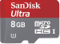

# SolidPC MicroSD Card Slot

## Revision and Notes

| **Date** | **Owner** | **Revision** | **Notes** |
| --- | --- | --- | --- |
| 19 Apr 2022 |     | 1.0 | Initial release |
| Table of Contents | - [Revision and Notes](#revision-and-notes) - [Description](#description) - [Speedtest](#speedtest) - [Schematics](#schematics)   - [MicroSD with 3.3v/1.8 switchover for UHS-1](#microsd-with-33v-18-switchover-for-uhs-1) |     |     |

## Description

The microSD removable miniaturized Secure Digital flash memory cards were originally named T-Flash or TF, abbreviations of TransFlash. TransFlash and microSD cards are functionally identical allowing either to operate in devices made for the other. It can be used as storage or booting up an operation system. The SolidPC supports UHS-1

## Speedtest

| **Brand** | **Read** | **Write** |
| --- | --- | --- |
| Sandisk Ultra 8gb | 23.2 mb/sec | 8.1 mb/sec |
| Sandisk Extreme 32gb | 35.8 mb/sec | 28.3 mb/sec |

## Schematics

#### MicroSD with 3.3v/1.8 switchover for UHS-1

