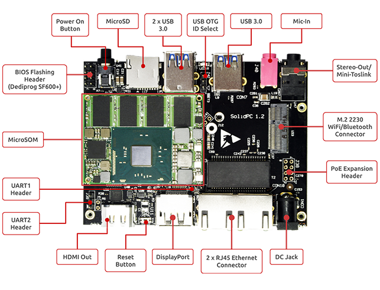

# SolidPC Q4

## Revision and Notes

| **Date** | **Owner** | **Revision** | **Notes** |
| --- | --- | --- | --- |
| 19 Apr 2022 |     | 1.0 | Initial release |
| Table of Contents | - [Revision and Notes](#revision-and-notes) - [Product Overview](#product-overview)   - [Main features](#main-features)   - [Specifications](#specifications)   - [What’s in the box?](#whats-in-the-box)   - [Cable setup and prerequisites](#cable-setup-and-prerequisites)   - [HW interfaces](#hw-interfaces) - [Software Install](#software-install)   - [List of supported OS](#list-of-supported-os)   - [How-to flash OS](#how-to-flash-os)   - [Linux terminal](#linux-terminal) - [Documentation](#documentation) - [Related Articles](#related-articles) |     |     |

## Product Overview

### Main features

- SoC: Intel Atom E8000 Quad Core
- Memory: Up to 4GB
- Storage: 8GB eMMC
- Temperature: Commercial (0C to 70C)
- OS: Linux, Android, Windows

### Specifications

|     |     |
| --- | --- |
| **SOM Model** | **Quad Core Intel Atom E8000** |
| Memory & Storage | Up to 4GB DDR3 |
|     | uSD UHS-1 Support |
|     | 8GB eMMC\* |
|     | M.2 (2242) SSD Connector |
| Connectivity | Displayport |
|     | HDMI 1.4b (up to 4k30fps) |
|     | 2 x RJ45 with PoE option |
|     | 3 x USB 3.0 Host |
|     | M.2 2230 Connector for WiFi/BT |
|     | Mic-In |
|     | Stereo Out / Toslink |
|     | 2 x UART Headers |
| I/O & Misc. | Power on Button |
|     | Reset Button |
|     | Indication LEDs |
| OS Support | Windows |
|     | Linux |
|     | Android |
| Dimensions | 100mm x 80mm |
| Power | DC input 7V-21V |
|     | Battery for RTC |
| Environment | Optional metal enclosure |

### What’s in the box?

- SolidPC Q4
- 12V 2.5A 220/110 Power adapter EU/US version (Optional)
- 16GB Micro SD card (Optional)
- Heatsink / Enclosure (Depending on the order)

### Cable setup and prerequisites

- Linux or Windows PC
- SolidPC Q4
- 12V Power adapter
- IP router or IP switch

### HW interfaces

Please see below the features overview of the connector side of the SolidPC Q4.

Print side connector overview of the SolidPC Q4.

## Software Install

### List of supported OS

Please see our [software](https://developer.solid-run.com/knowledge-base/software-overview/) page to install the OS.

### How-to flash OS

Please see how to [flash the OS](https://developer.solid-run.com/knowledge-base/flashing-an-sd-card/).

How to install & Flash [BIOS](../intel-braswell-ib8000-ib3710/ib8000-bios-flash-via-dediprog.md).

### Linux terminal

Please see our guide how to get to [Linux terminal via serial connection.](https://developer.resources.solid-run.com/wiki/spaces/developer/pages/287801409/Serial+Connection)

## Documentation

      

|     | File | Modified |
| --- | --- | --- |
| Labels  - No labels - [Edit Labels](#section-f00bf8d3-fc9a-4bc6-94d5-c1c13fae161b)  [Preview] [View](/wiki/download/attachments/349634561/solidpc-q4-schematics-rev-1.3.pdf?version=1) [Properties](/wiki/pages/editattachment.action?pageId=349634561&fileName=solidpc-q4-schematics-rev-1.3.pdf&isFromPageView=true) [Delete](/wiki/pages/confirmattachmentremoval.action?pageId=349634561&fileName=solidpc-q4-schematics-rev-1.3.pdf) | PDF File [solidpc-q4-schematics-rev-1.3.pdf](/wiki/download/attachments/349634561/solidpc-q4-schematics-rev-1.3.pdf?api=v2) | Apr 26, 2022 by [SolidRun](/wiki/people/557058:12be2ae4-3a6e-40cc-a677-bdfc4c987d1f) |
| Labels  - No labels - [Edit Labels](#section-454d0661-d6e0-4e71-bad2-646b4f182b67)  [Preview] [View](/wiki/download/attachments/349634561/solidpc-q4-gerbers-rev1.2.zip?version=1) [Properties](/wiki/pages/editattachment.action?pageId=349634561&fileName=solidpc-q4-gerbers-rev1.2.zip&isFromPageView=true) [Delete](/wiki/pages/confirmattachmentremoval.action?pageId=349634561&fileName=solidpc-q4-gerbers-rev1.2.zip) | ZIP Archive [solidpc-q4-gerbers-rev1.2.zip](/wiki/download/attachments/349634561/solidpc-q4-gerbers-rev1.2.zip?api=v2) | Apr 26, 2022 by [SolidRun](/wiki/people/557058:12be2ae4-3a6e-40cc-a677-bdfc4c987d1f) |
| Labels  - No labels - [Edit Labels](#section-9de209bb-7902-4da7-9278-cdde07dffcca)  [Preview] [View](/wiki/download/attachments/349634561/solidpc-rev1.2-component-side-silk.pdf?version=1) [Properties](/wiki/pages/editattachment.action?pageId=349634561&fileName=solidpc-rev1.2-component-side-silk.pdf&isFromPageView=true) [Delete](/wiki/pages/confirmattachmentremoval.action?pageId=349634561&fileName=solidpc-rev1.2-component-side-silk.pdf) | PDF File [solidpc-rev1.2-component-side-silk.pdf](/wiki/download/attachments/349634561/solidpc-rev1.2-component-side-silk.pdf?api=v2) | Apr 26, 2022 by [SolidRun](/wiki/people/557058:12be2ae4-3a6e-40cc-a677-bdfc4c987d1f) |
| Labels  - No labels - [Edit Labels](#section-b54b938d-c79d-4a8a-9a57-4e94592ccd06)  [Preview] [View](/wiki/download/attachments/349634561/sr-ibx-solidpc-full-assy-v1.zip?version=1) [Properties](/wiki/pages/editattachment.action?pageId=349634561&fileName=sr-ibx-solidpc-full-assy-v1.zip&isFromPageView=true) [Delete](/wiki/pages/confirmattachmentremoval.action?pageId=349634561&fileName=sr-ibx-solidpc-full-assy-v1.zip) | ZIP Archive [sr-ibx-solidpc-full-assy-v1.zip](/wiki/download/attachments/349634561/sr-ibx-solidpc-full-assy-v1.zip?api=v2) | Apr 26, 2022 by [SolidRun](/wiki/people/557058:12be2ae4-3a6e-40cc-a677-bdfc4c987d1f) |
| Labels  - No labels - [Edit Labels](#section-1bd65aba-34cb-42cd-bfc8-34b6a9f1494b)  [Preview] [View](/wiki/download/attachments/349634561/solidpc-q4-bom.xlsx?version=1) [Properties](/wiki/pages/editattachment.action?pageId=349634561&fileName=solidpc-q4-bom.xlsx&isFromPageView=true) [Delete](/wiki/pages/confirmattachmentremoval.action?pageId=349634561&fileName=solidpc-q4-bom.xlsx) | Microsoft Excel Spreadsheet [solidpc-q4-bom.xlsx](/wiki/download/attachments/349634561/solidpc-q4-bom.xlsx?api=v2) | Apr 26, 2022 by [SolidRun](/wiki/people/557058:12be2ae4-3a6e-40cc-a677-bdfc4c987d1f) |
| Labels  - No labels - [Edit Labels](#section-628e4104-2135-487d-a08a-7b6993e12ffb)  [Preview] [View](/wiki/download/attachments/349634561/solidpc-q4-enclosure.zip?version=1) [Properties](/wiki/pages/editattachment.action?pageId=349634561&fileName=solidpc-q4-enclosure.zip&isFromPageView=true) [Delete](/wiki/pages/confirmattachmentremoval.action?pageId=349634561&fileName=solidpc-q4-enclosure.zip) | ZIP Archive [solidpc-q4-enclosure.zip](/wiki/download/attachments/349634561/solidpc-q4-enclosure.zip?api=v2) | Apr 26, 2022 by [SolidRun](/wiki/people/557058:12be2ae4-3a6e-40cc-a677-bdfc4c987d1f) |
| Labels  - No labels - [Edit Labels](#section-91b3903b-1151-4c3d-989b-3f7d9209c0ff)  [Preview] [View](/wiki/download/attachments/349634561/solidpc-q4-heatsink.zip?version=1) [Properties](/wiki/pages/editattachment.action?pageId=349634561&fileName=solidpc-q4-heatsink.zip&isFromPageView=true) [Delete](/wiki/pages/confirmattachmentremoval.action?pageId=349634561&fileName=solidpc-q4-heatsink.zip) | ZIP Archive [solidpc-q4-heatsink.zip](/wiki/download/attachments/349634561/solidpc-q4-heatsink.zip?api=v2) | Apr 26, 2022 by [SolidRun](/wiki/people/557058:12be2ae4-3a6e-40cc-a677-bdfc4c987d1f) |
| Labels  - No labels - [Edit Labels](#section-d093346e-307c-4e5c-bdf3-db3f7b60284c)  [Preview] [View](/wiki/download/attachments/349634561/solidpc-q4-schematics-rev-1.3-dsn.zip?version=1) [Properties](/wiki/pages/editattachment.action?pageId=349634561&fileName=solidpc-q4-schematics-rev-1.3-dsn.zip&isFromPageView=true) [Delete](/wiki/pages/confirmattachmentremoval.action?pageId=349634561&fileName=solidpc-q4-schematics-rev-1.3-dsn.zip) | ZIP Archive [solidpc-q4-schematics-rev-1.3-dsn.zip](/wiki/download/attachments/349634561/solidpc-q4-schematics-rev-1.3-dsn.zip?api=v2) | Apr 26, 2022 by [SolidRun](/wiki/people/557058:12be2ae4-3a6e-40cc-a677-bdfc4c987d1f) |

[Download All](/wiki/download/all_attachments?pageId=349634561)

## Related Articles

Error rendering macro 'contentbylabel' : CQL was parsed but the search manager was unable to execute the search. Error message: com.atlassian.confluence.api.service.exceptions.scale.SSStatusCodeException: There was an illegal request passed to XP-Search Aggregator API : HTTP/1.1 403 Forbidden